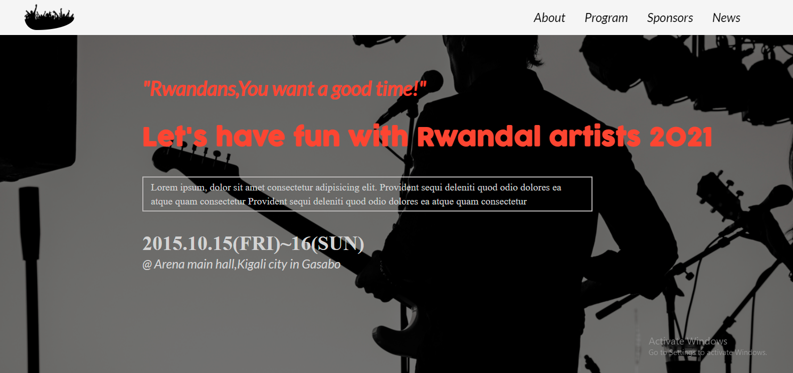

# Rwanda-all-stars-concert

> This is a website that advertise the concert in Rwanda with  
> Different artists and different performance.

Desktop view                                      |  Mobile Header view
:------------------------------------------------:|:-----------------------------------------------:
                     |  

## Built With

- HTML5 
- CSS
- JS 

## Project link

[Site Link](https://ishimwezachee.github.io/Rwanda-all-stars-concert/)

## Video Documentation
[Click here to see the project documentation video](https://www.loom.com/share/0201d1b893ab49f4b2ce0bda40a2eb3b)

## Getting Started
To get a local copy, just follow the steps That I am going to mention bellow:

### Prerequisites

### Setup
To get this project in your local machine, follow these steps:
- Open terminal 
- clone the repository :https://github.com/ishimwezachee/Rwanda-all-stars-concert.git
- Cd in the project folder
- run the project in your browser

### install
 - run npm install to install the required linters

 ### tests
 - run the project in the browsers 
 - use google tool to inspect and check in mobile version.

## Authors

👤 **Author1**

- GitHub: [@zacheeIshimwe](https://github.com/ishimwezachee)
- LinkedIn: [@zacheeIshimwe](https://www.linkedin.com/in/zachee-ishimwe-ab952a119/)

## 🤝 Contributing

Contributions, issues, and feature requests are welcome!

Feel free to check the [issues page](../../issues/).

## Show your support

Give a ⭐️ if you like this project!

## Acknowledgments
- Original design idea by
[Cindy Shin in Behance](https://www.behance.net/adagio07)

## 📝 License

This project is [MIT](./MIT.md) licensed.